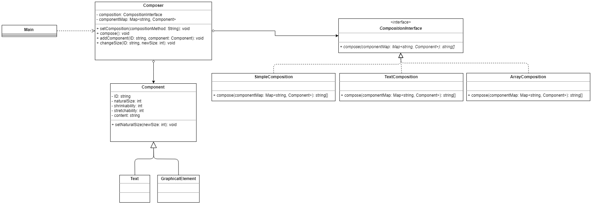

# Text Composition
Homework of design pattern: Strategy


## Spec
### Requirements Statement
* The Composition class maintains a collection of Component instances, which represent text and graphical elements in a document.
* A composition arranges component objects into lines using a linebreaking strategy.
* Each component has an associated natural size, stretchability, and shrinkability. 
* The stretchability defines how much the component can grow beyond its natural size; shrinkability is how much it can shrink. 
* When a new layout is required, the composition calls its compose method to determine where to place linebreaks.
* 
* There are 3 different algorithms for breaking lines:
    * Simple Composition: A simple strategy that determines line breaks one at a time.
    * Tex Composition: This strategy tries to optimize line breaks globally, that is, one paragraph at a time.
    * Array Composition: A strategy that selects breaks so that each row has a fixed number of items. It's useful for breaking a collection of icons into rows, for example.

### Input
```
#Four types of command
Text [ComponentID] [NaturalSize] [Shrinkability] [Stretchability] [Content] 
GraphicalElement [ComponentID] [NaturalSize] [Shrinkability] [Stretchability] [Content]
ChangeSize [ComponentID] [NewSize]
Require [BreakStrategy]
```

### Output
```
˙After ChangeSize command:
If NewSize < Shrinkability or Stretchability < NewSize:
    Print(“component [ComponentID] failed to change size”)
Else:
    Print(“component [ComponentID] size changed to [NewSize]”)

˙After Require command:
// display layout in [BreakStrategy] format …

˙SimpleComposition Format: // display one component for each line
// component format is [[currentSize]][Content] e.g. [1]Hi
e.g.
[1]Hi
[1]<ParagraphEnd>
[1]nice
[1]to
[1]meet
[1]you
[1]scared.jpg
[1]<ParagraphEnd>

˙TexComposition Format: // display all components before component with content <ParagraphEnd> in one line, split by space
e.g.
[1]Hi [1]<ParagraphEnd>
[1]nice [1]to [1]meet [1]you [1]scared.jpg [1]<ParagraphEnd>

˙ArrayComposition Format: // display 3 components in one line, split by space
e.g.
[1]Hi [1]<ParagraphEnd> [1]nice
[1]to [1]meet [1]you
[1]scared.jpg [1]<ParagraphEnd>

```

### Comments
Please display components in input order.

There won’t be any repeating [ComponentID], and there will only be existing [ComponentID] in ChangeSize command.

Arguments [NaturalSize], [Stretchability], [Shrinkability] and [NewSize] are guaranteed to be integers.

[BreakStrategy] is limited to “SimpleComposition”, “TexComposition” and “ArrayComposition”.


Please implement your main function in Class Main.

We'll test your program through "java Main inputFile"

e.g java Main sampleInput


Do not read input from System.in or hard code input file, or your program won’t pass any test case.

### Upload
Please zip your source code and upload it.

The file name should be Team[teamID].zip. e.g. Team7.zip

The folder structure should be:
```
   unzip Team7.zip
=> [dir] Team7
=>       Team7/*.java
```
You won’t receive any point if you didn’t follow the directory structure or main class name or compressed format!

## How to run
```
cd Team1
javac ./*.java
java Main ../tests/test_input
```
